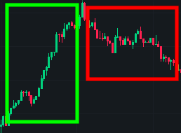
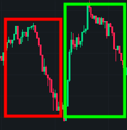
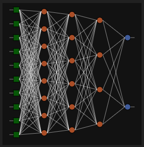
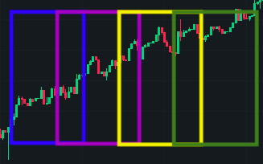

# brainjs-cryptocurrency-trend

> Cryptocurrency ML price prediction. Ready for connection to any crypto exchange to trade with limit orders


## Contribute

> [!IMPORTANT]
> There is made by using [react-declarative](https://github.com/react-declarative/react-declarative) to solve your problems. **⭐Star** and **💻Fork** It on github will be appreciated

## Usage

**1. Start this app**

> Build

```bash
sh ./scripts/build.sh
```

> Run

```bash
npx open-cli http://localhost:8080
npm run start:binance
```

**2. Configure the neural network. If you can't just press save button, default config is good enough**

**3. Wait for whales patterns interception (will take around 10 minutes or more). Open Chrome Dev Tools for detailed log**

**4. (Optional) Start Telegram informer (./packages/informer)**

**5. Enjoy!**

## How it is made

The bot is observing `HIGH` values on the `1M` candle chart of the crypto exchange. It is trying to collect market whale patterns to detect them and predict price change.



To do that It listening the exchange `1M` candle websocket until It finds a spike or a space between two spikes. From the technical side it combines values by groups with 100 records (each message per 250ms) and [uses linear regression to compute slope](https://stackoverflow.com/questions/6195335/linear-regression-in-javascript).



The sign of Slope variable means the trend: negative (`red rect`) if price is going downward or positive (`green rect`) if price is going forward. So when the bot see the pair of groups with trend `[-1, 1]` or `[1, -1]` it capture them and start training neural network



The neural net takes only the last 10 prices from a market as an input and 2 values as an output. If the price rises, it  return `[1, 0]`. If the price will fall it return `[0, 1]`



To use a group with 100 price records as a set for training I am using [stride tricks](https://developers.google.com/machine-learning/practica/image-classification/convolutional-neural-networks). That helps me emulate receiving last 10 values from a websocket just like in real time. But as I am already known the trend, the training of neural network is easy peasy (check `green`, `violet`, `yellow`, `green` rects)


FYN If you have your own DAU which owns more than `10 000$` for trading feel free to contact me, I got a lot of solutions of that kind for crypto currencies

P.S. for binance use `wget -qO- http://ipecho.net/plain | xargs` command to check your ip.
